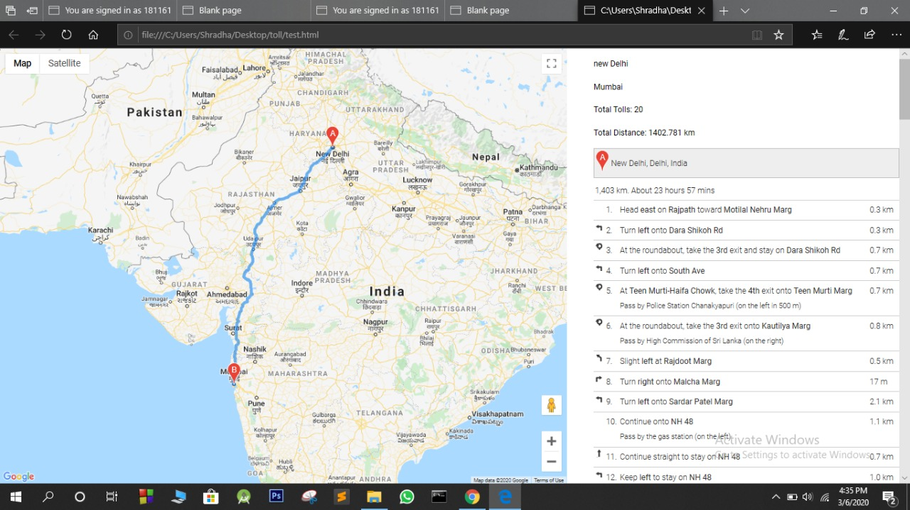
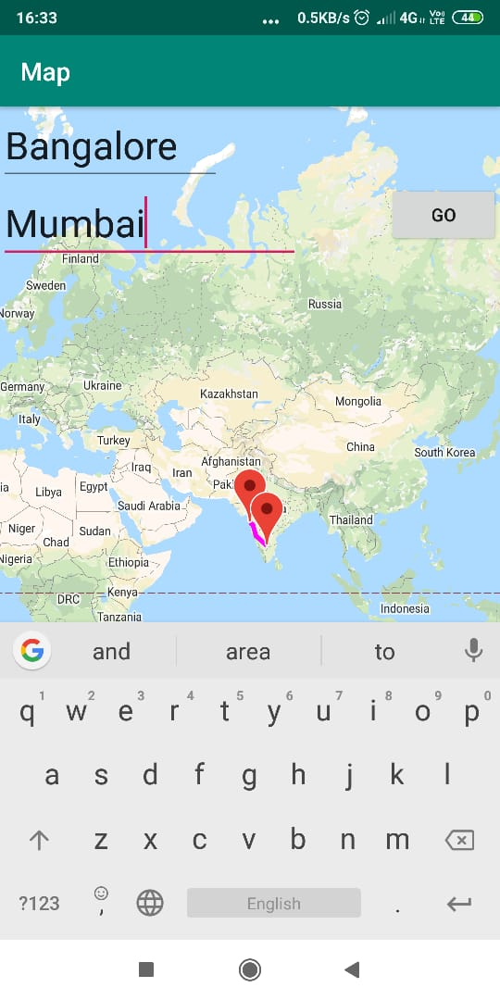
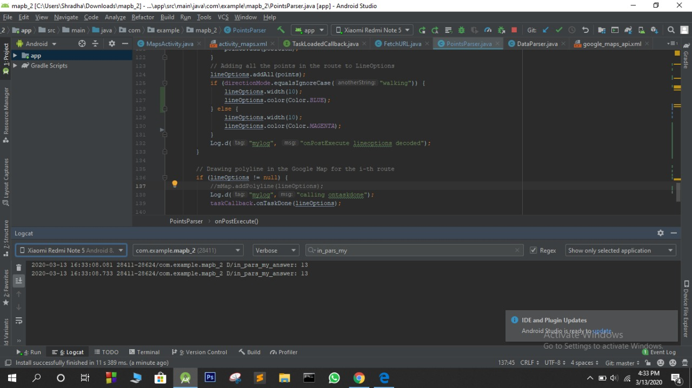

# IE Toll Cost Calculator (2019-20)

### PROBLEM STATEMENT
Android vehicle toll payment using RFID is a method which aims at reducing the queuing delay at the toll plazas and makes toll payment accessible from the source point. A user can enter his/her source and destination in the application, and in return, the app will show the shortest path with the cost of tolls (if any present).
This project aims to make the payment process easier and also give an idea to the user about the shortest route that can sometimes have no tolls. The result of this would be less wastage of fuel, time, and not so long queues in the toll plazas.
Another important thing is that the user will have an idea of how much would it cost if the given route is taken so that the user account has sufficient balance left to be used up in the journey. If the user refrains from making payment via app then also it would be useful to have an idea about the travelling cost.

### PROPOSED SOLUTION
The basic working of the app is to take source and destination from the user and as an output, it gives us the total number of tolls and its cumulative cost between the two-point. The solution can be split into two tasks, one is to get the shortest route between the points and then calculate the number of tolls.
For task one, we can easily achieve this with the help of google maps API. The google maps elegantly return us the coordinates of the source and destination. After getting the two points to say A and B we put markers on this and draw a polyline to trace the path. Again which is assisted by google direction API. Now we have the shortest route and we have traced the path. The direction API returns a JSON object which contains information about objects in the path including the toll. We will retrieve the information about tolls on the way. We count the number of tolls encountered in the path and multiple it with the cost we have stored.

### TECHNOLOGY USED
* Android Studio
* Java for android
* Google directions API
* Google maps API.

### METHODOLOGY

* Phase 1: Enabling the Google Maps Directions API. We visited the Google Cloud Platform Console. Created a new Project and activated the Directions API.
* Phase 2: Showing the markers on the map.
  We took the source and destination as input as strings from the user and geocoded that into latitude and longitude using the LatLng module.
  Markers were made using the MarkerOptions module of android maps. Phase 3:Creating Direction Request and printing the polyline. Polyline would be showing the desired route between source and destination. This was made possible by creating an Http direction request to the webservice. We fetched the data from the request in the form of a JSON object.
* Phase 4:Finding the number of tolls.
  The result of the direction request is a JSON object. It has the routes and legs which contains the address of the waypoints. This contains the string "toll road" if it has a toll. We searched the JSON object for the string and counted the total number of tolls on the way.
  Pseudocode:
  ```java
  computeTotalTolls (result)
  total = 0;
  myroute = result.routes[0];
  totalTolls = 0;
  for (i = 0; i < myroute.legs.length; i++)
  for (j = 0;j < myroute.legs[i].steps.length; j++)
  if (containsWord(myroute.legs[i].steps[j].instructions, 'toll road'))
  totalTolls += 1;
  ```
* Phase 5:Printing the total cost.
  We assigned a dummy cost which when multiplied by the total number of The toll would return the required balance the user would need to have in their FasTag Wallet.

### RESULTS
We could obtain the optimal path with the least toll cost.

* Input
  
  Using the API for webpage
  
  Using the API for android app
  <center>
  
  </center>

* Output

  The console has the count for the number of tolls in the optimal part (_```13``` tolls in this case_)
  

### FUTURE WORK
The frontend can be improved. The method of collecting information from the user can be improved.

### KEY LEARNINGS
Google directions API and android framework.

### CONCLUSION
The backend logic was implemented. The toll cost estimates can help a user maintain sufficient balance in his account since the tolls now have made it mandatory to include a FASTag on a vehicle using their services.

### MEMBERS
* [Shrinidhi A V](https://github.com/shrinidhi99)
  * [Shraddha G](https://github.com/ShraddhaGole)
  * [Shonali K S](https://github.com/shonali-ks)
* Darshan V
* Archana P

### REFERENCES
* [https://nevonprojects.com/android-vehicle-toll-payment-system/](https://nevonprojects.com/android-vehicle-toll-payment-system/ "Android Vehicle Toll Payment Using 2 Factor Authentication")
* [http://ijiet.com/wp-content/uploads/2018/06/8.pdf](http://ijiet.com/wp-content/uploads/2018/06/8.pdf "Online Toll Payment System")
* [http://www.ijsrp.org/research-paper-0415/ijsrp-p4080.pdf](http://www.ijsrp.org/research-paper-0415/ijsrp-p4080.pdf "Security Based Electronic Toll Collection Using NFC and
Android Application")
